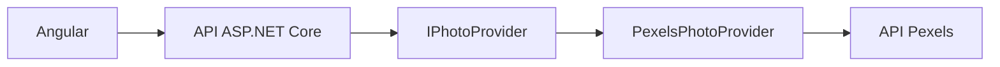

# Référence Dessin

Application web d’entraînement au dessin utilisant des photographies Pexels comme références visuelles.

L’utilisateur peut obtenir des références aléatoires ou rechercher un thème, configurer une durée de dessin et naviguer entre les images.

## Fonctionnalités

- affichage de références aléatoires fournies par Pexels ;
- recherche par mot-clé ;
- navigation précédente et suivante ;
- raccourcis clavier ;
- minuteur configurable avec lecture, pause et réinitialisation ;
- passage automatique à l’image suivante ;
- préchargement de l’image suivante ;
- gestion des erreurs de chargement ;
- affichage étendu de l’image dans un overlay ;
- interface responsive ;
- attribution du photographe et lien vers Pexels.

## Technologies

### Backend

- C# ;
- .NET 10 ;
- ASP.NET Core Web API ;
- `HttpClient` ;
- OpenAPI ;
- xUnit.

### Frontend

- Angular 22 ;
- TypeScript ;
- Angular Signals ;
- RxJS ;
- Vitest ;
- Lucide Icons ;
- SCSS.

## Architecture



Le backend est organisé en trois projets :

- **Application** définit les modèles et les contrats nécessaires au cas d’utilisation ;
- **Infrastructure** implémente l’accès au service Pexels ;
- **Api** expose les fonctionnalités au client Angular et configure l’application.

```text
ReferenceDessin/
├── Back/
│   └── ReferenceDessin/
│       ├── src/
│       │   ├── ReferenceDessin.Api/
│       │   ├── ReferenceDessin.Application/
│       │   └── ReferenceDessin.Infrastructure/
│       └── tests/
│           ├── ReferenceDessin.Api.Tests/
│           └── ReferenceDessin.Infrastructure.Tests/
│
└── Front/
    └── reference-dessin-web/
        └── src/app/
            ├── core/
            └── features/
```

La clé Pexels reste exclusivement côté serveur. Elle n’est jamais transmise au navigateur ni enregistrée dans le dépôt Git.

## API

### Récupérer des références

```http
GET /api/photos?query=portrait&count=30
```

Paramètres :

| Paramètre | Obligatoire | Description |
|---|---:|---|
| `query` | Non | Thème recherché. Sans valeur, les photos sélectionnées par Pexels sont utilisées. |
| `count` | Non | Nombre de photos demandé, compris entre 1 et 80. La valeur par défaut est 30. |

Les erreurs provenant de Pexels sont renvoyées au format standard `ProblemDetails` :

- `502 Bad Gateway` lorsque le service externe retourne une erreur ;
- `504 Gateway Timeout` lorsque le service externe met trop de temps à répondre.

## Installation

### Prérequis

- SDK .NET 10 ;
- Node.js 24 ;
- npm ;
- une clé API Pexels.

### Configurer le backend

Depuis la racine du dépôt :

```bash
cd ReferenceDessin/Back/ReferenceDessin
```

Configurer la clé Pexels avec .NET User Secrets :

```bash
dotnet user-secrets set \
  "Pexels:ApiKey" \
  "VOTRE_CLE_PEXELS" \
  --project src/ReferenceDessin.Api
```

Démarrer l’API :

```bash
dotnet run --project src/ReferenceDessin.Api
```

En développement, l’API HTTP est disponible par défaut sur :

```text
http://localhost:5183
```

### Configurer le frontend

Depuis la racine du dépôt :

```bash
cd ReferenceDessin/Front/reference-dessin-web
```

Installer les dépendances :

```bash
npm ci
```

Démarrer Angular :

```bash
npm start
```

L’application est alors disponible sur :

```text
http://localhost:4200
```

Le serveur de développement Angular transmet les appels `/api` au backend grâce au proxy configuré dans `proxy.conf.json`.

## Tests

### Backend

Depuis la racine du dépôt :

```bash
dotnet test ReferenceDessin/Back/ReferenceDessin/ReferenceDessin.sln
```

Les tests couvrent notamment :

- la construction des requêtes vers Pexels ;
- la conversion des réponses Pexels ;
- les erreurs du service externe ;
- la validation du nombre de photos ;
- les réponses HTTP `ProblemDetails`.

### Frontend

```bash
cd ReferenceDessin/Front/reference-dessin-web
npm test -- --watch=false
```

Les tests couvrent notamment :

- l’affichage et les actions du minuteur ;
- la construction des requêtes HTTP ;
- la transmission des mots-clés ;
- la réception des photos ;
- la propagation des erreurs HTTP.

## Compilation

### Backend

```bash
dotnet build \
  ReferenceDessin/Back/ReferenceDessin/ReferenceDessin.sln \
  --configuration Release
```

### Frontend

```bash
cd ReferenceDessin/Front/reference-dessin-web
npm run build
```

## Intégration continue

Le workflow GitHub Actions exécute automatiquement à chaque `push` et pull request :

- la restauration des dépendances ;
- la compilation du backend ;
- les tests .NET ;
- l’installation des dépendances Angular ;
- les tests Vitest ;
- la compilation du frontend.

Le workflow se trouve dans :

```text
.github/workflows/integration-continue.yml
```

## Sécurité

- la clé Pexels est stockée avec .NET User Secrets en développement ;
- aucune clé API n’est présente dans le frontend ;
- les erreurs techniques sont journalisées côté serveur sans être exposées au client ;
- les appels vers Pexels disposent d’un délai maximal ;
- les paramètres reçus par l’API sont validés.

## Améliorations envisagées

- compléter le découpage de l’interface en composants Angular ;
- ajouter des tests de parcours utilisateur ;
- ajouter une capture d’écran au README ;
- conteneuriser l’application ;
- déployer le frontend et le backend.